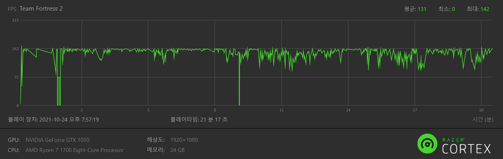

# TF2-CONFIG

> made by [SYS](https://steamcommunity.com/profiles/76561198206033049/)


### HOW TO INSTALL(설치방법)

```bash
./Steam/steamapps/common/Team Fortress 2/tf
```

### START OPTIONS(시작옵션)

```cfg
-novid -nojoy -nosteamcontroller -nohltv -particles 1 -precachefontchars -noquicktime
```

### CUSTOMIZE(사용자 정의 설정)

```bash
# 개인설정(binds, other commands)
tf/cfg/user/autoexec.cfg

# mastercomfig moudules(마스터컨픽 모듈)
tf/cfg/user/modules.cfg

# TF2 class config(팀포 클래스별 설정)
tf/cfg/user/<tf2 class name>.cfg
```

## FPS DATA(대충 벤치돌렸다는 내용)

Ryzen 1700(None OC) / DDR4 3200 8G x2(16G) / GTX 1050(Nvidia 511.xx_

MGE (AVG : 144)


SWIFTWATER


BADWATER


Casual FPS `60~143`(maybe avg fps `60~90`)
