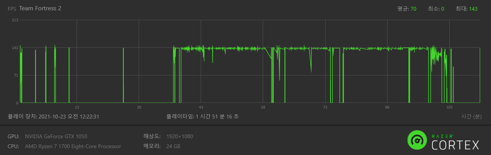
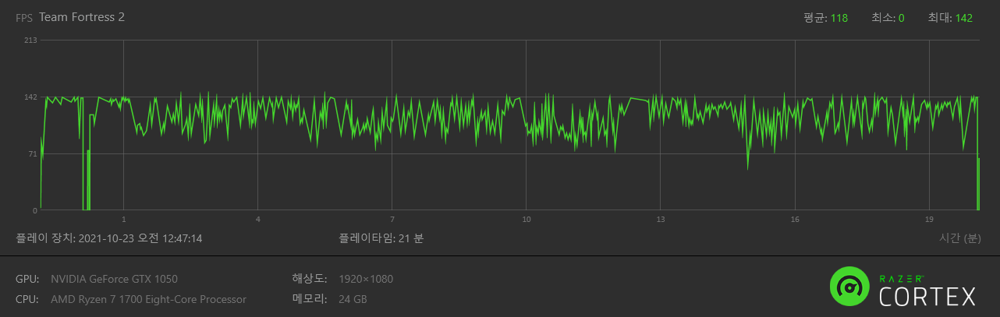

# TF2-CONFIG

> made by [SYS](https://steamcommunity.com/profiles/76561198206033049/)


### HOW TO INSTALL

아래 경로에 설치

```bash
./Steam/steamapps/common/Team Fortress 2/tf
```

### START OPTIONS

```cfg
-novid -nojoy -nosteamcontroller -nohltv -particles 1 -precachefontchars -noquicktime
```

### CUSTOMIZE

```bash
# 개인설정(binds, other commands)
tf/cfg/user/autoexec.cfg

# mastercomfig moudules
tf/cfg/user/modules.cfg

# TF2 class config
tf/cfg/user/<tf2 class name>.cfg
```

## FPS DATA

Ryzen 1700 / DDR4 2666 8G x3 / GTX 1050  

MGE (AVG : 144)


SWIFTWATER


BADWATER

